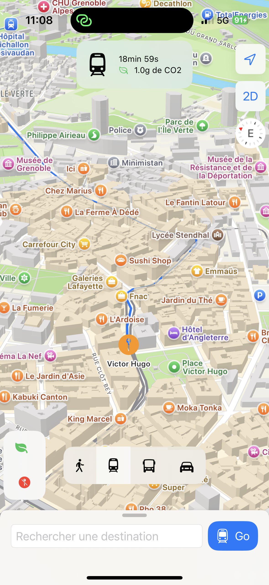

//
//  README.md
//  HackatonMARGO
//
//  Created by Mathis Sedkaoui on 15/03/2025.
//

# Hackaton MARGO

Notre application utilise l'API m-TAG proposée dans le sujet pour calculer les trajets en transports en commun et en marchant.
Nous utilisons également le Framework MapKit d'Apple pour afficher la carte, les points d'intérêts et calculer les trajets en voiture.
MapKit ne permet pas d'afficher les lignes de tram, nous utilisons donc l'API m-TAG pour récupérer les positions des lignes et les dessiner.

Nous avons implémenté une approximation du nombre de grammes de CO2 consommés pour chaque trajet, et l'objectif à terme (pas implémenté) est de
donner un score à l'utilisateur en fonction de ses trajets passés.

